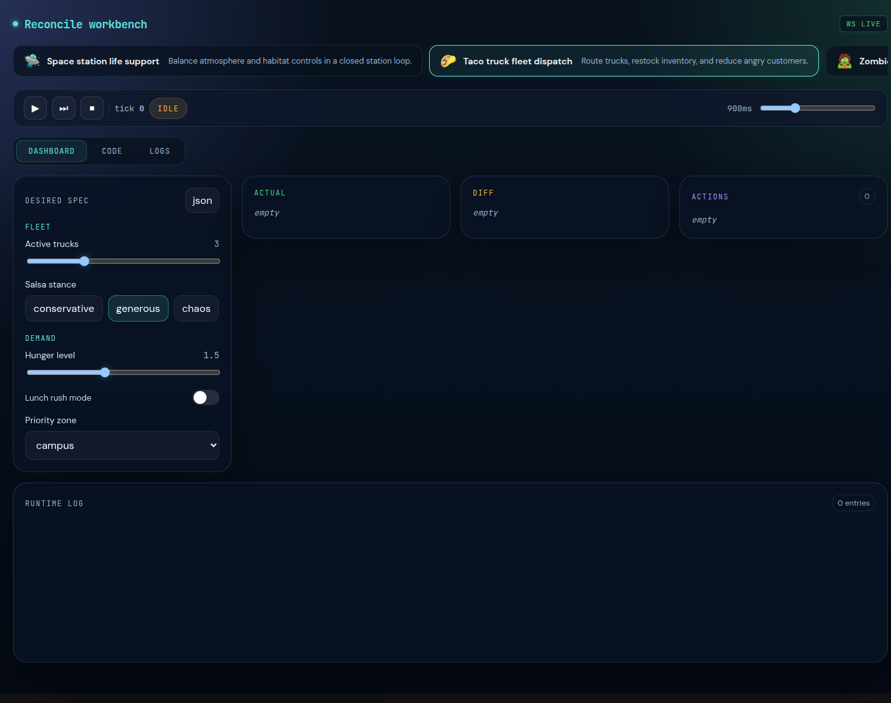

# Scenario Runtime Workbench

An interactive workbench for exploring reconciliation loops as first-class, inspectable systems.

This project runs a generic scenario runtime in Go, lets each scenario define its own behavior in JavaScript, and exposes the whole control loop in a browser UI. Instead of hiding everything inside one opaque "reconcile" function, the application shows the four important stages directly:

1. observe the world
2. compare actual state to desired state
3. plan corrective actions
4. execute those actions

That makes the system useful both as a teaching tool and as a debugging environment for controller-style behavior.



## Why This Exists

Most controller demos show results, not reasoning. This one makes the reasoning visible.

The backend owns the lifecycle, session state, event publication, and transport APIs. Each scenario package owns the domain-specific logic for "what the world looks like" and "what to do next". The frontend renders backend-authored snapshots instead of inventing local truth.

That split gives you three strong properties:

- the runtime stays generic even when scenarios are very different,
- scenario-specific implementation can stay hidden inside JavaScript,
- operators can still inspect desired state, observed state, drift, actions, and logs at every tick.

## What You Can Do With It

- Run a scenario and step through one reconciliation tick at a time.
- Switch between scenario presets without changing backend code.
- Edit desired state from generated controls.
- Inspect the current `desired`, `actual`, `diff`, `actions`, and runtime logs.
- Debug whether a problem belongs to observation, comparison, planning, execution, transport, or rendering.

## Project Shape

```text
React workbench
  -> HTTP + WebSocket API
    -> Go session/runtime
      -> Goja sandbox
        -> scenarios/<preset>/*
```

Important directories:

- `cmd/scenario-demo`
  CLI entrypoint and embedded help integration.
- `internal/app`
  App assembly and config loading.
- `internal/scenario/catalog`
  Preset loading from disk.
- `internal/scenario/runtime`
  Session state machine and Goja sandbox.
- `internal/scenario/server`
  HTTP and WebSocket handlers.
- `internal/web`
  Embedded frontend serving.
- `ui/`
  React workbench.
- `scenarios/`
  Scenario packages with JSON metadata and `observe/compare/plan/execute` JavaScript files.
- `internal/doc/`
  Canonical embedded documentation.

## Quick Start

Run the server:

```bash
go run ./cmd/scenario-demo serve
```

Then open:

```text
http://localhost:3001
```

Useful overrides:

```bash
go run ./cmd/scenario-demo serve --addr :4010 --scenarios-dir ./scenarios
```

If you want to rebuild the embedded frontend bundle:

```bash
go generate ./internal/web
```

## How A Scenario Works

Each preset under `scenarios/` is a self-contained package:

```text
scenarios/<id>/
  scenario.json
  spec.json
  ui.json
  observe.js
  compare.js
  plan.js
  execute.js
```

The runtime orchestrates the loop. JavaScript defines what each stage means for that scenario.

Host helpers available inside the JavaScript sandbox:

- `getState(key)`
- `setState(key, value)`
- `log(message)`
- `randomFloat(min, max)`
- `randomInt(min, max)`
- `round(value, decimals)`

The sandbox is intentionally narrow. Scenario logic can be expressive without gaining arbitrary access to the server.

## API Surface

Main routes:

- `GET /api/healthz`
- `GET /api/presets`
- `GET /api/presets/{id}/ui`
- `POST /api/session/preset`
- `POST /api/session/run`
- `POST /api/session/pause`
- `POST /api/session/step`
- `POST /api/session/reset`
- `GET /api/session/spec`
- `PUT /api/session/spec`
- `POST /api/session/speed`
- `GET /api/session/snapshot`
- `GET /ws`

The browser fetches an initial snapshot over HTTP and then listens for live updates over WebSocket.

## Documentation

The deeper docs live in the embedded help system and in `internal/doc/`.

Start here:

```bash
go run ./cmd/scenario-demo help
go run ./cmd/scenario-demo help operating-the-demo
go run ./cmd/scenario-demo help runtime-architecture
go run ./cmd/scenario-demo help reconciliation-loop-reference
go run ./cmd/scenario-demo help intern-guide-to-scenario-runtime
```

Especially useful:

- `operating-the-demo`
  Getting started and first-run workflow.
- `runtime-architecture`
  Backend architecture and transport model.
- `reconciliation-loop-reference`
  The core observe/compare/plan/execute abstraction.
- `intern-guide-to-scenario-runtime`
  A detailed onboarding guide with diagrams, pseudocode, API notes, and debugging strategy.

## Development Notes

- The project behavior is scenario-driven even if some legacy naming still refers to "pod deployment".
- The backend snapshot is the source of truth. If the UI looks wrong, compare it with `/api/session/snapshot` before debugging components.
- If you are adding scenario-specific rules in Go, that is usually a sign the logic should live in the JavaScript stage files instead.

## Testing

```bash
go test ./...
```

For docs-only validation:

```bash
go test ./internal/doc ./cmd/scenario-demo
```
